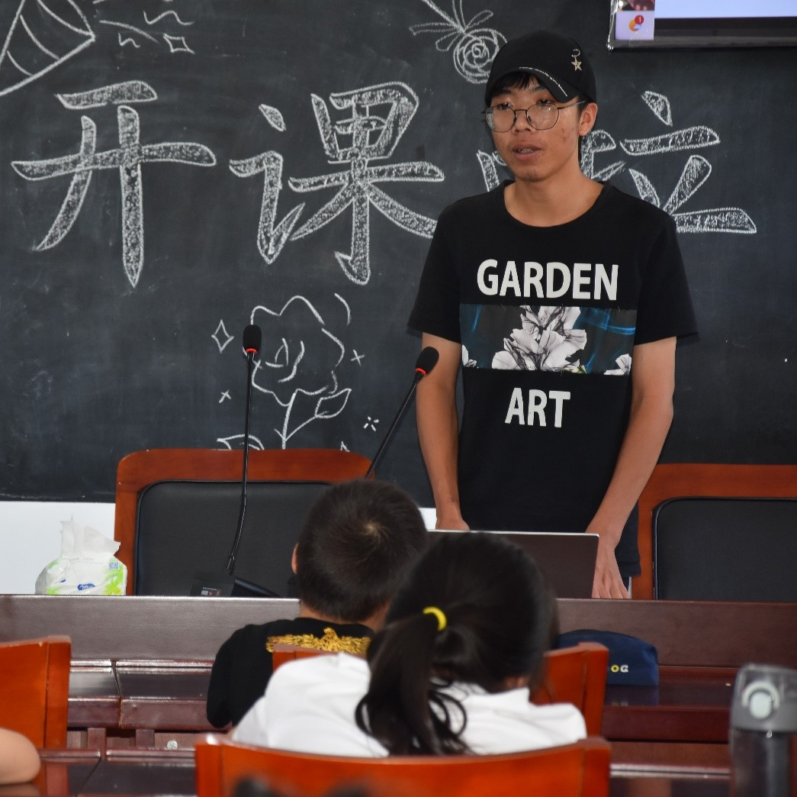
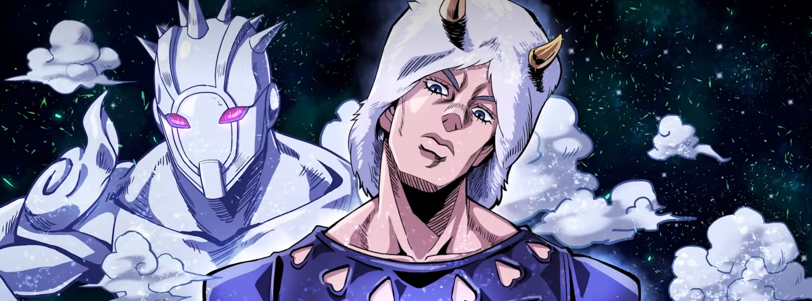

# 晚安短信 from 泷月

## 自我介绍
<del>Ciallo～(∠・ω< )⌒★</del> o(〃'▽'〃)o Hi!

本人是来自某院飞设专业的一只大二小白，泷月DA★ZE。

20岁。住在紫金港北部的蓝田一带，未婚。我在折大上学。每天都要赶ddl到很晚。我吃夜宵，经常喝快乐水。晚上1点以后睡。睡前，我一定把游戏日常任务清掉，上了床马上熟睡。一觉到天亮，还是累得要死。医生都说我活到现在是个奇迹。（快速吟唱）

车万人，阴暗死宅，中二病，重度社恐以及伟大的ddl战士（雾）。经常各种姿势赶ddl。死人微活，日常摆烂。梦想是技术宅拯救世界。生活照是没有的，只有一些工作照和证件照（大雾）。

爱好是干饭，睡觉，长跑，以及任何有趣的事情。偶尔打游戏，经常偶尔。喜欢的作品有《游戏人生》、《冰菓》、《JOJO的奇妙冒险》、《葬送的芙莉莲》、《鬼刀》、《非人哉》和《东方Project》（灵魔是在下所见之真实）。

PS1：只是觉得女孩子之间真是好啊（紬大小姐说的）
PS2：本人没有患不用魔理沙头像和夹带主角组贴贴私货就会死的病

取命废，所以昵称一般源自喜欢的作品。ID同时是我星铁的昵称，取自Miku的《胧月》，然后因为非常喜欢《Lycoris Recoil》的泷奈，故称“泷月”。热知识，DA☆ZE是魔理沙的口癖（但是☆在昵称中打不出来），而DAZE是无敌的阿强的口癖（Yare\~Yare~DAZE）。

## 校园生活

### 高中篇
重庆奉节人，但是在浙江湖州（就是“浙E浙E湖州”的那个湖州）某不知名高中（虽然在市里但被县中吊打，乐）读书，所以高中过得相当惬意。因为没有设备，在人均开摆的氛围里姑且算是“小镇做题家”。不过高三摸鱼导致最后不得不靠三一攀上浙大（不过其实最后也没有降分，三一政策又限制了我转专业），zju极少数不是考败来浙的废柴。但是，三十年河东，三十年河西，莫欺少年穷，莫欺中年穷，莫欺老年穷，死者为大（你想说什么啊）。

半文半理的优雅选课——生物、历史、物理。物理很菜主要就是为了专业而学，历史爱好者，生物课代表。

### 大学篇

#### 学习经历

你说的对，但是《学在浙大》是由浙江大学自主研发的一款开放世界冒险游戏。在这里，你将扮演一位名叫“zjuer”的角色，导引绩点之力，消灭ddl，苟过大学四年。

学习超绝蒟蒻，还是不提了吧，唯一一门拿得出手的是定向越野（乐）。经常考前补天，导致绩点崩坏。大一下尝试一天速通一门课程，得到的教训是菜就多练、学不起就别选。目前在被大学物理和理论力学拷打，有物理巨佬可以教教摸（卑微）。

目前课业难度较大一有了提升，33学分的课表也有点累（但比中管恐怖的课程学习肯定是轻松多了）。冬学期五天早八专业课，还有Python数据分析和模糊神经网络两门专业课（这就是某院逆天培养方案）。不喜欢刷夜，但因为不够自律经常熬到很晚。诚招一个学习搭子，提醒我补药再摸鱼了。

#### 志愿服务

有空去当志愿者，感觉尸体暖暖的。参与过挺多有意思的志愿活动，比如去生仪年会吃茶歇（bushi）。下图是暑假支教ing，带xpy挺有意思的。

#### 学生组织

败犬经历非常丰富，蓝田分团委、科协科研部、网安竞赛部blabla，感谢求是潮的收容我这个校园安定分子。同时在浙大青志服务和航院学生会打工。比较好玩的是和青志的小伙伴们一起夜袭北高峰，结果山上两点多起雾看不到流星。

社团报的挺多的，有网络安全协会、夸父跑盟、动漫社、东方同好会。但因为社恐属性太重基本没参与过线下活动。
#### 科研竞赛

科研报了启真问学，研究方向是量子变分算法和涡动力学。SRTP立了项，但其实主要靠工高er、直博北大流体力学的大佬学长推进。

竞赛没啥经验，有佬愿带可以积极学习，提前组队求捞。

## 日常生活

### 情感篇
!!! quote 春物
    さまよえる孤高の魂はよりどころを必要としねえんだよ
    孤高的自由灵魂不需要羁绊之地

我要闹了，我闹了，我已经在闹了。<del>牡丹太久了，精神状态有点美丽。</del>

### 游戏篇

!!! quote 游戏人生
    さぁ、ゲームをはじめよう
    现在，游戏开始了

二游（？）主要是《东方归言录》，Steam上有时玩推理解谜和生产经营（其实没怎么玩），闲的时候也会玩gal和stg，最近入坑炉石。最后，我们的游戏蒸蒸日上（这辈子有了）。

### 摸鱼篇
!!! quote 日常
    日々私たちが过ごしている日常は、实は、奇迹の连续なのかもしれない
    我们所经历的每个平凡的日常，也许就是连续发生的奇迹 

基本看看番、吃吃饭、睡睡觉一天就过去了（雾）。生活非常不规律，随性而定。比如周二晚上例行熬夜赶ddl，然后周三早八补觉（是九点五十赶早十的优质大学牲）。

喜欢吃辣（杭州美食荒漠qaq）。每天课上都在思考吃什么。胃大，无须多盐。心情不好的时候食量会翻倍。恩格尔系数超高。喜欢草莓味的棒棒糖（可乐味也行）。不知道自己吃过多少片面包。

听歌很杂，流行、国风、动漫、古典都听。喜欢的歌会单曲循环。最近在听《童祭~Innocent Treasures》。

读一点书。散文尤爱汪曾祺先生的。村上春树的短篇也看。强烈安利马伯庸的历史小说。偶尔读日系推理。

理想主义。穷尽毕生追求价值和意义。<del>虽然连未来想做什么都不知道。</del>

二次元浓度不算高。尚未觉醒女装爱好。没钱吃谷，没去过漫展，没出过cos。很少玩音游和galgame。不会板绘（虽然有板子），不会日语（日漫白看了），不会跳宅舞（橙舞都不会qaq），不会做MAD（Atri老师教教），不会Blender（qsc除我皆佬qaq）。不过以上其实都挺感兴趣的，但因为<del>很懒</del>节能主义所以自学不了一点。

常年黑/白色T恤+黑色裤子（别问，问就是耐脏）。在操场不定期刷新。去年年末第一次跑了半马。这学期打卡比较少，有想跑长跑的uu欢迎找我捏（配速比较养生）。

虽然挺少水群的，但其实是个很有意思的人（maybe）。有人约的话可以一起去干饭、骑行、爬山、看展、打乒乓球。在下社交圈很窄，米娜桑多来找我玩口牙。

最后附上在下没什么东西的[Blog](https://happystarkitty.github.io/)以及[Notebook](https://happystarkitty.github.io/StarDiary)，欢迎交换友链！

## Weather Report

你说我放错图片了，让我换成原来的？搭嘎，口头哇路！（你就说是不是天气预报吧）

最后祝大家晚安好梦。