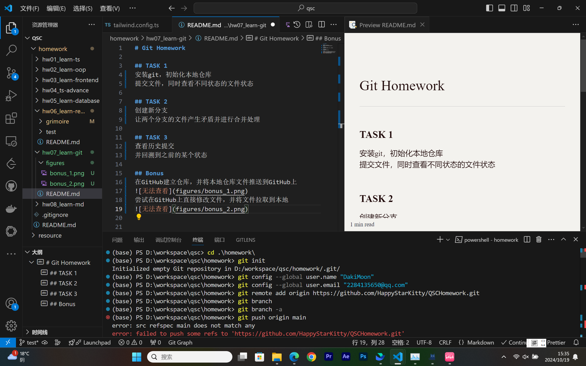
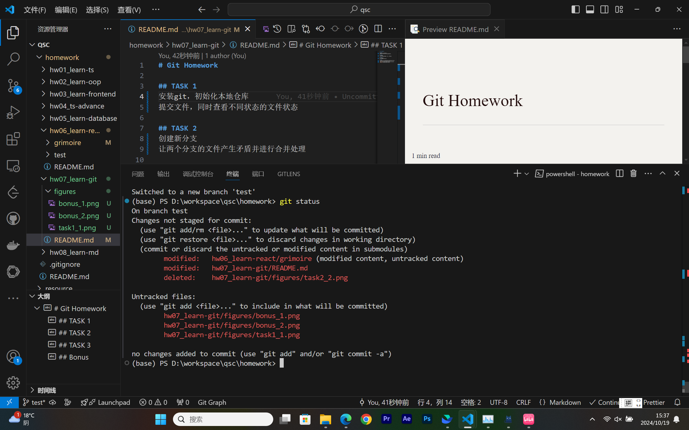
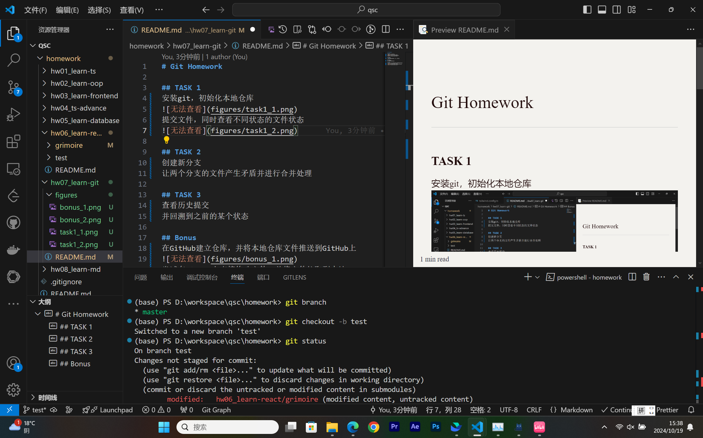
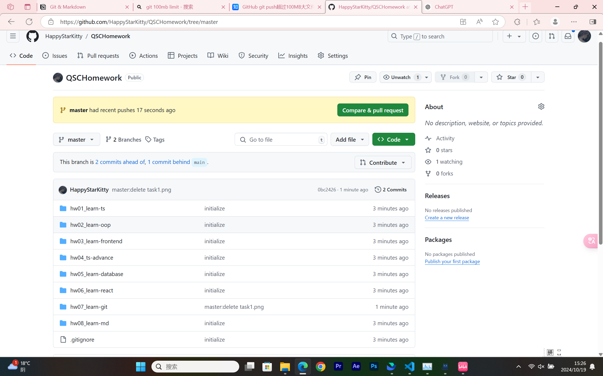
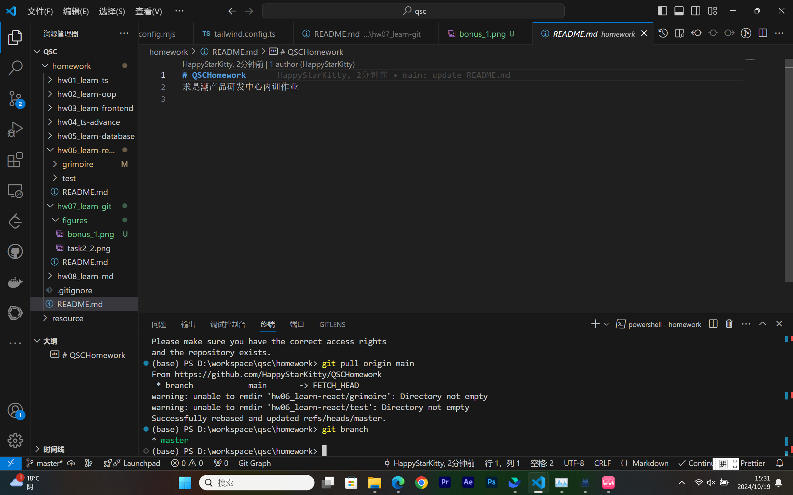

# Git Homework

## TASK 1
安装git，初始化本地仓库

提交文件，同时查看不同状态的文件状态

## TASK 2
创建新分支

让两个分支的文件产生矛盾并进行合并处理

## TASK 3
查看历史提交
并回溯到之前的某个状态

## Bonus
在GitHub建立仓库，并将本地仓库文件推送到GitHub上

尝试在GitHub上直接修改文件，并将文件拉取到本地

